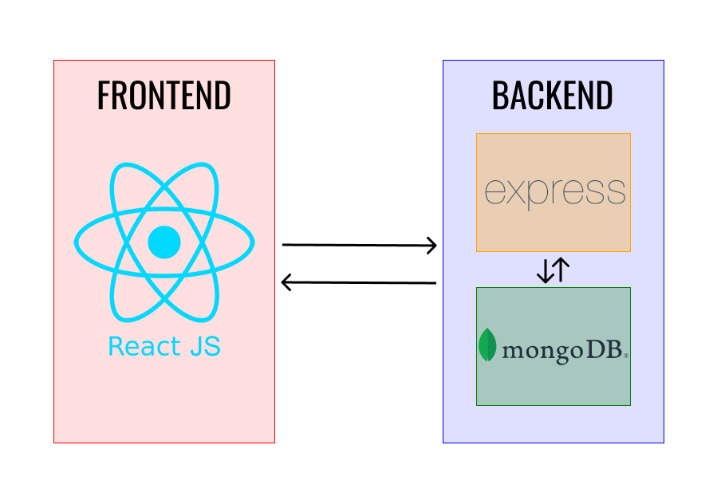

# Sketchio ( MODULE  01 )

`(TOC)`

## Introduction

​	Hey there !!, welcome to **Sketchio**, a multiplayer game wherein you sketch and others guess, clone of the very popular Skribbl game (which is an online modification of [Pictionary](https://en.wikipedia.org/wiki/Pictionary) game we play).

​	We will cover the entire project over a period of 10 days, after which you will be given some time for open innovation, where you are free to add as many as features as you wish to make your project unique and outstanding. But before we move on further, let’s have a rough overview of the project.

### Overview of the project

​	Over the period of 10 days, we will be building a project that will have: 

+ A chat component, so that players can communicate, set user defined _words_, and _guess_ the word from the sketch,

+ A draw board component, to sketch with different stroke colours and sizes,

+ A leader board component to display the points and standings of players, and

+ A landing page to join and create rooms

​	As you can see, this is an example of a **Full Stack Project**.

### What do you mean by a Full Stack Project?

​	Any application be it a website, or a desktop application or a mobile phone application, has a certain user interface, something you see and interact with, that interface is called the Frontend of that application (or the client-side application). Now, apart from the visual and interactive part, an application also requires something called as Backend (or the server-side application) to govern the behaviour of it, for example when you search for something on Google, how does it fetch the results? or rather what makes the results and sends it to you ? or maybe when you are playing a multiplayer online game, what makes it multiplayer ? This is an invisible part that the end users don't really see, but it encapsulates the main logic of the application. Besides these, there is one more part called as a Database which as the name suggests stores data, for example when you are shopping on Amazon, your cart items are stored in the database, so when you visit the website again, you can see them.

​	So a full stack project is simply one which involves both frontend and backend, and usually utilising a Database (sometimes this is also considered as part of the backend) to store data. Now, there are a lot of different pre-written frameworks / libraries in different languages already present out there, and usually constitute the [stack](https://en.wikipedia.org/wiki/Solution_stack) of the application. One popular stack (at least at the time of writing this) is the [**MERN**](https://www.mongodb.com/mern-stack) stack, which means **M**ongoDB for the database, **E**xpress for the server, **R**eact for the frontend library, and **N**ode as the runtime environment for development in JavaScript.

### Architecture of a typical App



## Prerequisites

​	The project can be followed by anyone who is interested, but a basic knowledge in the following would help:

+ Basics of internet like, IP address, Ports, TCP etc

+ Basics of HTML and JavaScript (Arrays, functions, classes etc)

​	Now if you feel confident enough in the above fundamentals, let's dive into one of the core concept of the project, namely **Web Sockets**. And build the chat component of the project.

### WebSockets

> WebSocket is a computer communications protocol, providing full-duplex communication channels over a single TCP connection.
>
> The WebSocket protocol enables interaction between a web browser (or other client application) and a web server with lower overhead, facilitating real-time data transfer from and to the server. This is made possible by providing a standardized way for the server to send content to the client without being first requested by the client, and allowing messages to be passed back and forth while keeping the connection open. In this way, a two-way ongoing conversation can take place between the client and the server. ~ [_Wikipedia_](https://en.wikipedia.org/wiki/WebSocket)

​	Remember, in the _Setup module_ we installed a package `socket.io`, what does this package do is make implementing `WebSockets` super easy and understandable and also gives a lot of other functionalities such as broadcasting and namespacing.

Now, let us connect 

So moving on let's edit the `eventHandlers.js` file to implement:

+ A normal chat,
+ The logic of setting up a _word_ to guess, and
+ The logic for guessing the _word_.

## Normal Chat

​	So how does a chat works ? A player sends a message to the server, server sends (or _broadcasts_) the message to other players and this happens with each player. In `socket.io`, we can do this very easily by:

```javascript
// Client
socket.emit('msg', /*The message goes here*/)

// Server
socket.on('msg', /*A callback function that will handle the broadcast of the message goes here*/)
```

​	The `client side` part for this depends on the mechanism of your `broadcast` in the `callback` function, but an overview of it might be just adding a `input` field and emitting the `msg` event on submit and when you recieve the `msg` event you can simply make a `paragraph` tag and append it to a `container` div, so that messages are visible to the players ( This can also be done in a smart way by using [`Acknowledgements`](https://socket.io/docs/v4/emitting-events/#acknowledgements)). Pseudo code for doing this in `React` is:

```jsx
...
msgs = [/*Keep a track of message content and sender*/]
...
return (
    {msgs.map((msg,i) => <p key={i}>msg.sender: msg.content</p>)}
)
...
```

## `word` Setup logic

​	There are different ways, you can implement this feature, either having a dedicated `input` field or something like that. But to spice up things a little, why not implement this in the chat itself. You can do this by having some prefix to differentiate between this and normal chat and `emit` out a different `event` if the message that a player enters has that prefix, like:

```javascript
// in the `input` field's onsubmit handler
if (msg.startsWith('!')) {
    socket.emit('word', /*The `word` goes here*/)
} else {
    socket.emit('msg', ... )
}
```

## `word` Guessing logic

​	Now, that a word is set

