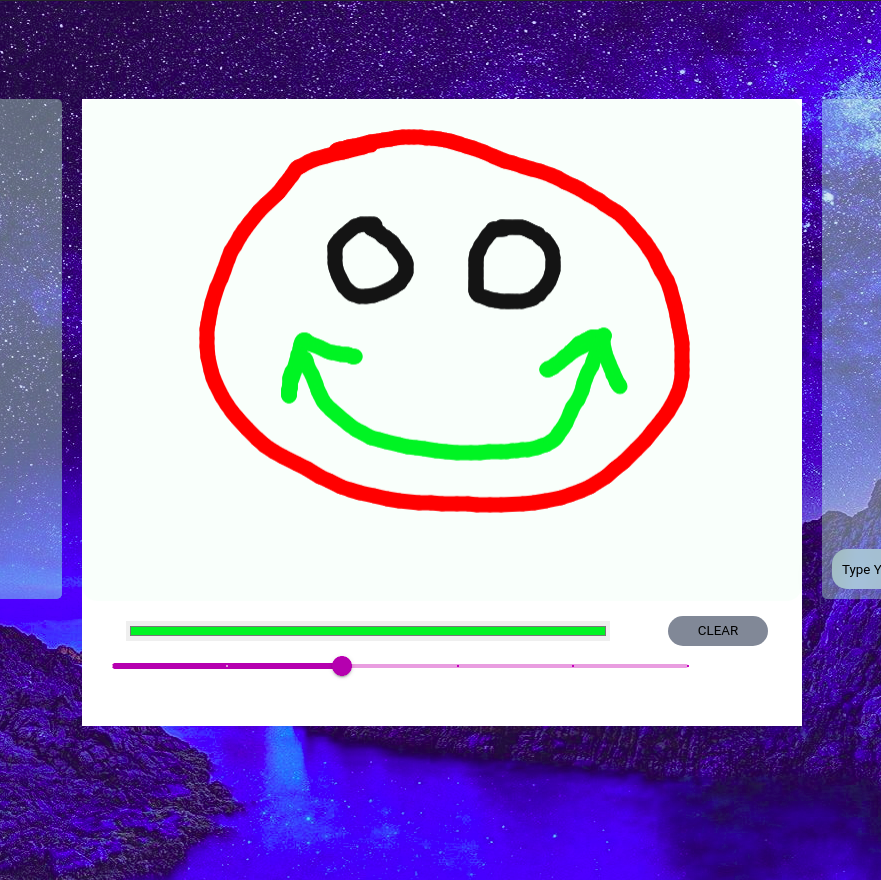

# Sketchio ( MODULE 3 )

## Draw Component

Now, whenever we think of skribbl, the first word thought that strikes our mind is DRAWING, thus let’s start creating our very own draw component.

As we all know components are a crucial part of ReactJs which literally makes our lives easier. Thus let’s start by creating a component dedicated to our BOARD for the draw area as in the drawing board which will contain all the logics namely,

- Drawing on paint app function

- Mouse Capturing logic

- Socket logics
  So start by creating an independent component say  `board.jsx` Now to be specific this component contains only the logic and renders just the `<canvas>` element.

## The Canvas element

   A canvas is a single DOM element that encapsulates a picture. It provides a programming interface for drawing shapes onto the space taken up by the node.It converts the shapes to pixels (colored dots on a raster) as soon as they are drawn and does not remember what these pixels represent. Canvas graphics can be drawn onto a `<canvas>` element.

  You can give such an element `width` and `height` attributes to determine its size in pixels.Now, a new canvas is empty, meaning it is entirely transparent and thus shows up as empty space in the document.The `<canvas>` tag is intended to allow different styles of drawing. To get access to an actual drawing interface, we first need to create a *context*, an object whose methods provide the drawing interface. There are currently two widely supported drawing styles: "2d" for two-dimensional graphics and "webgl" for three-dimensional graphics through the OpenGL interface.

  **Here,we’ll stick to two dimensions.**

  You create a context with the getContext method on the `<canvas> ` DOM element.So start with the draw on canvas function;

```javascript
var canvas = document.querySelector("#Board");
ctx = canvas.getContext("2d");
var sketch = document.querySelector("#sketch");
var sketch_style = getComputedStyle(sketch);
```

  **Note:** here `sketch` and `Board` are ids of two different divs which are used to return the Canvas element in `Board.jsx`.

  After creating the context object you’ll be able to draw the canvas according to your preferences using different properties like `fillRect`,
  `strokeRect`,
  `fillStyle`,
  `strokeStyle`,to name a few.
  The mouse capturing logic and the paint logic are the main part of this function.Remember to declare variables according to your need which you will use for the logics later on.

Now, moving to the logics:
Use canvas.addEventListener

- Attach a `mousedown`,event listener to the canvas DOM.

- On this event, get the mouse coordinates, and use the `moveTo()` method to position your drawing cursor, and

- `beginPath()` method to begin a new drawing path.

- Again, attach `mousemove` event listener to the DOM.

- On `mousemove` add a new point continuously to the path using `lineTo()` ,and 

- use `stroke()` to color the last segment.

- Last, but not the least, use `mouseup` event listener and set a flag to disable the drawing.

Congratulations, your onPaint function is ready, but don’t forget to test the code you have written, for this you need to `render` , then `return` the `<canvas>` element.

Now since ReactJs gives the liberty to make independent components, why not make another, say `Container.jsx` which will contain all the elements that we want to render and return and show it to the viewers.

Do not forget to IMPORT `Board.jsx` inside `Container.jsx`


Now, add all the divs and classes you want, to showcase the canvas. It totally depends upon you, how you would like to design your canvas. Add all the necessary CSS again according to your choice and then `render` the Board Component inside the Container Component

**Do not forget to import the css files**

You can use any React-lifecycle method or hooks to render the Draw On Canvas function depending on your code whether you are using a class component or a function component.

If you have followed the steps properly then you’ll be able to draw on the canvas by now.

From here, you can add all kinds of other features like giving the user the ability to choose a line thickness, color, brush strokes, and even layers.

## `setTimeout` Function

The Draw Board is all set with the functionality, what comes next is the socket connection part so that all our friends who are playing the game with us can view the sketch we are doing, but before that let’s add a `setTimeout` function.

### Why `setTimeout`?

Without `setTimeout` there will be server calls for each point you are drawing, but with `setTimeout` there will be server calls only after drawing completion of a segment or may be a line say, this will help to reduce bandwidth usages significantly. So `setTimeout` will help us send data only when the user pauses for a second when a specific segment of drawing is completed.
So, let’s start with the pseudocode

- Define a class variable with name `timeout` in `Board.jsx`

- Now, go to the DrawOnCanvas function and before onPaint method define a variable `root = this`

- Now, inside OnPaint function write `setTimeout` function

- Inside the `setTimeout` function get the base64 encoded image data from `Canvas`

We have to define the root variable because inside the `setTimeout` function this keyword will point out to the function and not the Board Class and finally add
- an if statement to `clearTimeout` when `root.timeout` is not undefined.

```javascript
if (root.timeout !== undefined) clearTimeout(root.timeout);
```

This ensures to execute a single timeout function excluding the earlier ones.

## Sockets Logic


- Go to `Board.jsx` and import `socket` object from `sockets.js` file.
- Go to the onPaint function and add `socket.emit` function that emits the canvas data from the base64 encoded image string
```javascript
socket.emit("canvas-data", base64ImageData);
```

- Now `”canvas-data”` event has to be same with the event that receives the data
- Go to the Board class constructor `socket.on` and write a function that uses data which is received by the server in the form of an image source which is the base64 encoded image string.

- Add `image.onload` function that creates an image using that data.

- This drawing will be displayed in all other users' canvas.

## Change color and brush size

- Give the users the option to change the brush size, and the color

- This can be done by passing parameters and keeping each parameter as colour change and brush change.

- First, create a wrapper div for all the tools in the `Container.jsx` 

- Add a brush-size container and a color-picker container under return

- Add a label for Color and brush respectively.

- For brush size you may add a drop down or can even use material ui to style.

- Define 6 different sizes for now the way you want the brush.

Done with html !

Now let’s see the logic

- Inside the constructor define the state objects in `Container.jsx`

- For now, keep two properties inside the state object color and size, give the default value as your choice.

- Now, bind the state object properties with color picker inputs and similarly do that for brush size.

- Set value to `this.state.color` and `this.state.size`.

- Now for both, add the OnChange method.

- Set `this.changeColor.bind(this)` for color and similarly do that for brush size.

- Now, define `changeColor` and `changeSize` methods.

- Create the methods and set the set property method with the `setState` method.

- Both takes parameter, and keep the updated values as `params.target.value` respectively,

- Now pass the color and size values to the Board Component, thus add two attributes with the Board Component.

- Now, add the css you want for the tools container.

Now proceed to the `Board.jsx` component and there receive the size and color and accordingly adjust canvas drawing.

- First in the component declare ctx, and then change `var = ctx` to `this.ctx`, in the DrawOnCanvas function.
`var ctx = this.ctx`

- Now receive the color and size from the `Container.jsx` for that you can use hook methods of react components.

- In the DrawOnCanvas function, change the lineWidth and strokeStyle as per property values.

New features added!

# Clear canvas function

- The clear Canvas function allows user to clear the canvas with one button use

- Make a button wherever you want to create it, (here,`Container.jsx`)

- Give OnClick to the button and define a function that handles the ClearCanvas function.

- Now , define the function and use the `clearRect` method to clear the canvas, give the coordinates of height and width of the canvas carefully. 

The Clear Canvas button should work!

The draw area component is ready 




​    